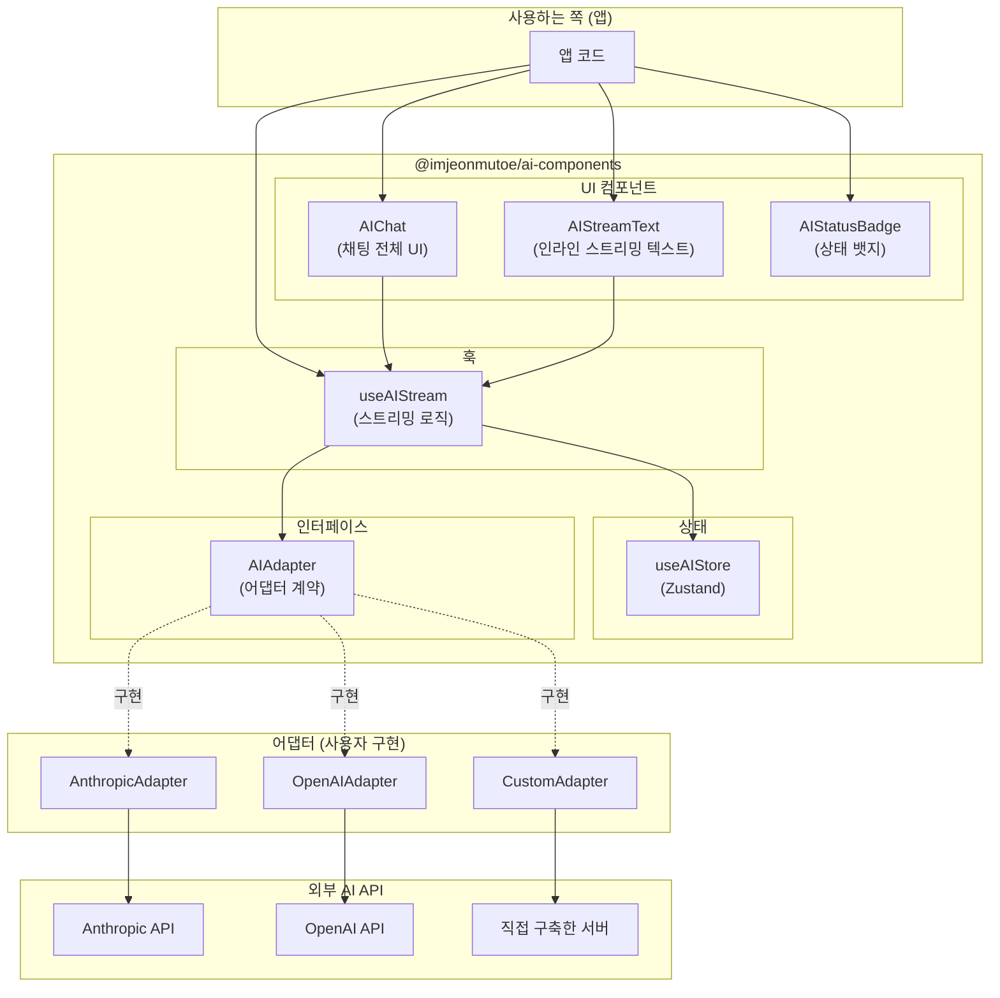
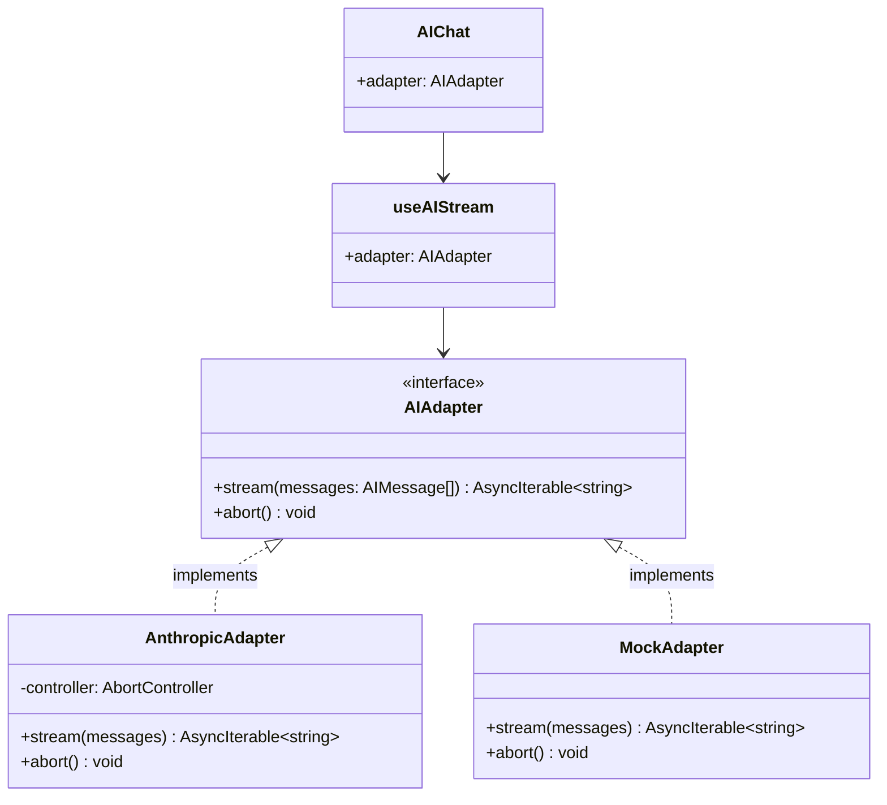
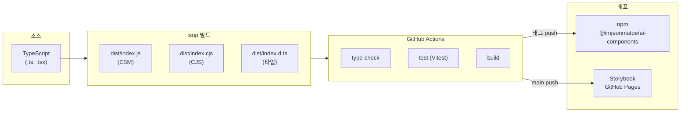

# 아키텍처 개요

## 모노레포 구조

```
ai-component-library/
├── packages/
│   ├── ai-components/        ← npm 배포 대상 (핵심 라이브러리)
│   └── tailwind-config/      ← Tailwind 프리셋 공유
├── apps/
│   ├── demo/                 ← Next.js 15 쇼케이스 앱
│   └── api/                  ← FastAPI SSE 스트리밍 서버
└── docs/                     ← 문서
```

pnpm workspace + Turborepo로 패키지 간 빌드 캐시 및 의존성을 관리합니다.

---

## 레이어 구조



---

## 어댑터 패턴

라이브러리는 어떤 AI 프로바이더를 사용하는지 **알지 못합니다**.
`AIAdapter` 인터페이스만 만족하면 어떤 구현이든 연결할 수 있습니다.



### 어댑터 구현 예시

```typescript
// 어댑터가 지켜야 할 계약 (라이브러리 정의)
interface AIAdapter {
  stream(messages: AIMessage[]): AsyncIterable<string>;
  abort(): void;
}

// 사용자가 자신의 AI API에 맞게 구현
const anthropicAdapter: AIAdapter = {
  async *stream(messages) {
    const controller = new AbortController();
    const res = await fetch('/api/chat', {
      method: 'POST',
      body: JSON.stringify({ messages }),
      signal: controller.signal,
    });

    for await (const chunk of parseSSE(res.body)) {
      yield chunk; // 문자열 청크를 하나씩 yield
    }
  },
  abort() {
    controller.abort();
  },
};
```

---

## 빌드 파이프라인



---

## 파일 구조 (ai-components)

```
packages/ai-components/src/
├── index.ts                    ← 공개 API 진입점
├── types/
│   └── index.ts                ← AIAdapter, AIMessage, AIError, AIStatus
├── store/
│   └── useAIStore.ts           ← Zustand 전역 상태
├── hooks/
│   ├── useAIStream.ts          ← 핵심 스트리밍 훅
│   └── __tests__/
│       └── useAIStream.test.ts
├── components/
│   ├── AIChat.tsx
│   ├── AIStreamText.tsx
│   ├── AIStatusBadge.tsx
│   ├── AIChat.stories.tsx
│   ├── AIStreamText.stories.tsx
│   ├── AIStatusBadge.stories.tsx
│   └── __tests__/
│       ├── AIStreamText.test.tsx
│       └── AIStatusBadge.test.tsx
└── test/
    ├── setup.ts
    └── mocks/
        ├── server.ts           ← MSW 서버 설정
        └── handlers.ts         ← SSE 스트리밍 Mock 핸들러
```