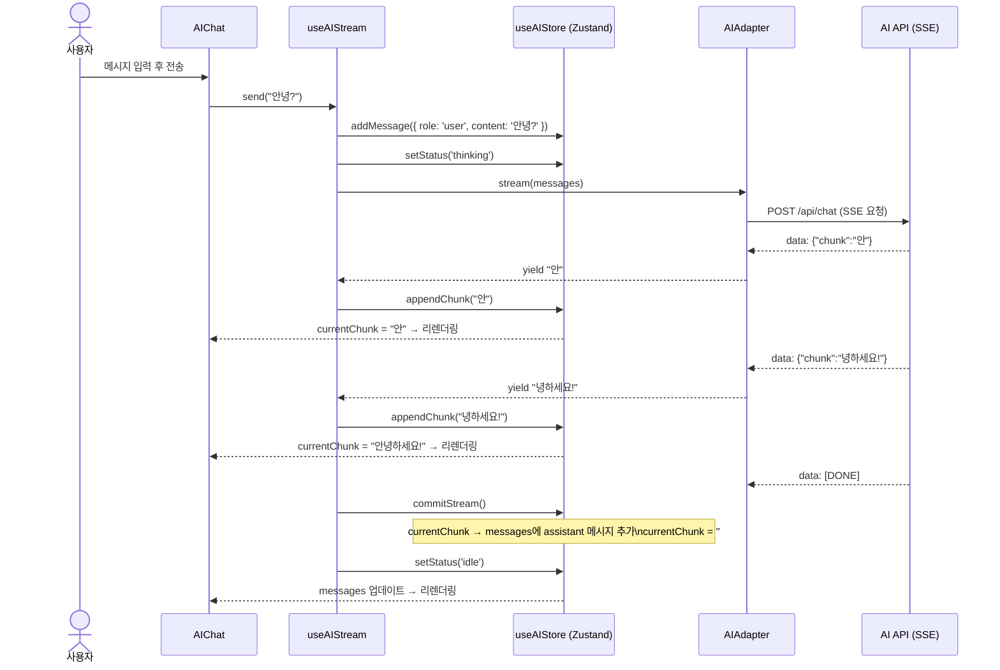
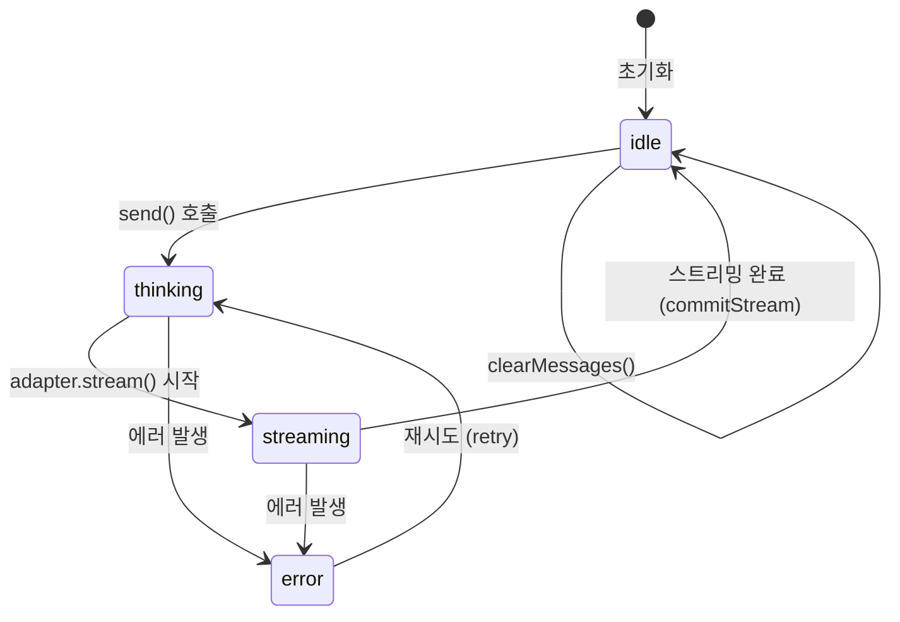
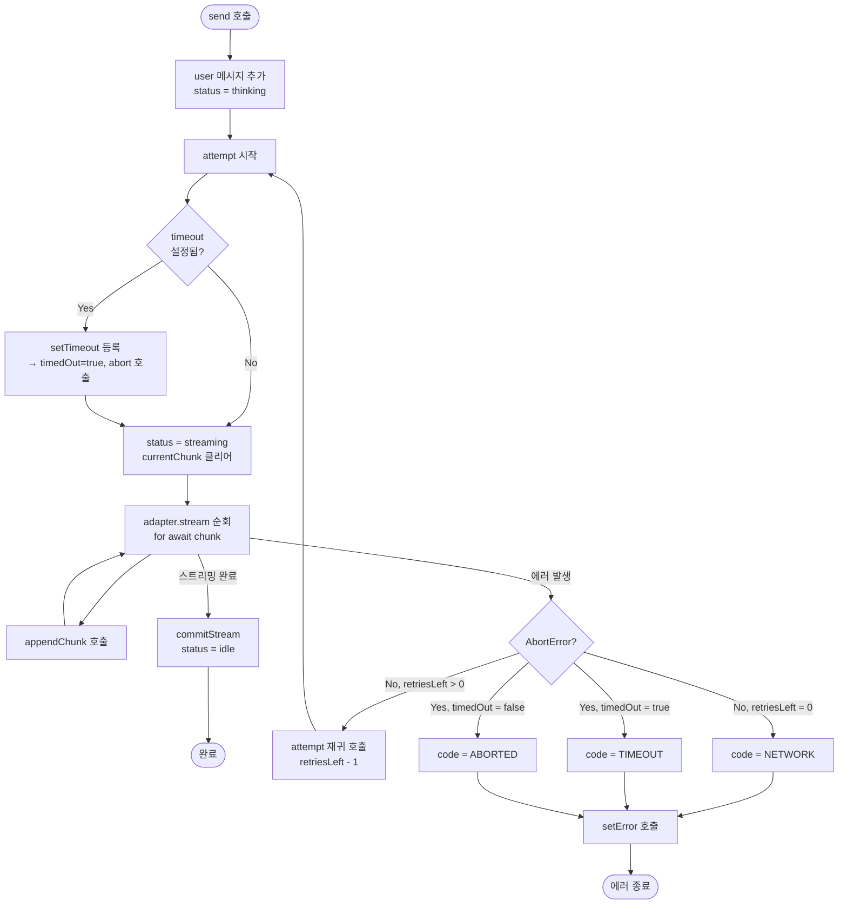
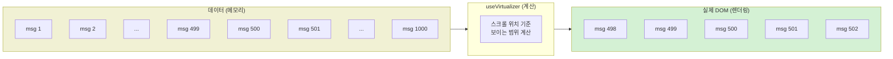

# 데이터 흐름 & 상태 관리

## 전체 데이터 흐름



---

## Zustand 상태 구조



### 상태별 데이터

| status | messages | currentChunk | error |
|--------|----------|--------------|-------|
| `idle` | 완성된 메시지 목록 | `''` | `null` |
| `thinking` | user 메시지 추가됨 | `''` | `null` |
| `streaming` | user 메시지 추가됨 | 실시간 누적 중 | `null` |
| `error` | user 메시지 추가됨 | `''` (클리어) | `AIError` |

### 스토어 액션

```typescript
// useAIStore 액션 목록
setStatus(status)       // 상태 전환
addMessage(message)     // 메시지 배열에 추가
appendChunk(chunk)      // currentChunk에 문자열 누적
clearCurrentChunk()     // currentChunk = ''
commitStream()          // currentChunk → assistant 메시지로 확정
setError(error)         // 에러 저장 + currentChunk 클리어
clearMessages()         // 대화 초기화
reset()                 // 전체 초기 상태로 복귀
```

---

## useAIStream 내부 흐름



---

## 메시지 가상화 흐름

`@tanstack/react-virtual`을 사용해 DOM에는 **현재 보이는 항목만** 렌더링합니다.



### 가상화 구현 핵심

```typescript
// 1. 렌더링할 아이템 배열 구성 (메시지 + 상태 아이템)
const virtualItems = useMemo<VirtualItem[]>(() => {
  const items = messages.map(message => ({ kind: 'message', message }));
  if (status === 'thinking') items.push({ kind: 'thinking' });
  if (status === 'streaming') items.push({ kind: 'streaming', content: currentChunk });
  if (error) items.push({ kind: 'error', message: error.message });
  return items;
}, [messages, status, currentChunk, error]);

// 2. 가상화 설정
const virtualizer = useVirtualizer({
  count: virtualItems.length,
  getScrollElement: () => scrollRef.current,
  estimateSize: () => 60,        // 예상 행 높이 (px)
  overscan: 5,                   // 뷰포트 밖 여유 렌더링 수
});

// 3. 새 메시지 추가 시 자동 스크롤
useEffect(() => {
  if (virtualItems.length > 0) {
    virtualizer.scrollToIndex(virtualItems.length - 1, { behavior: 'smooth' });
  }
}, [virtualItems.length]);
```

---

## 에러 코드 분류

| code | 발생 조건 | 재시도 가능 |
|------|-----------|-------------|
| `NETWORK` | HTTP 오류, 파싱 실패 등 | ✅ maxRetries 소진 전까지 |
| `TIMEOUT` | timeout 옵션 초과 | ❌ |
| `ABORTED` | 사용자가 직접 abort() | ❌ |
| `UNKNOWN` | 기타 예상 밖 에러 | ❌ |